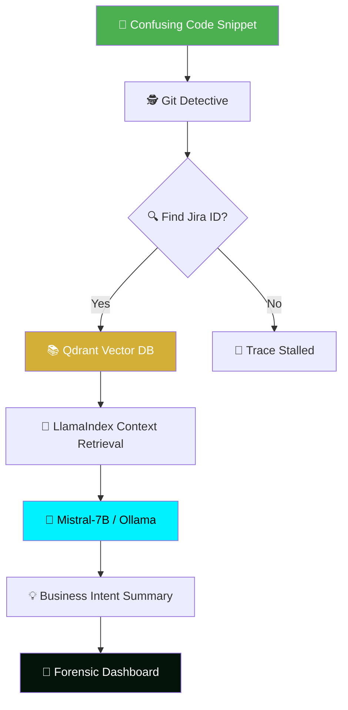

<div align="center">

# 🕵️‍♂️ Sherlock-RAG — Forensic Code Intelligence

[](https://git.io/typing-svg)


<br/>

[](https://why-summarizer-project.streamlit.app/)

<br/>

[](https://github.com/mayank-goyal09/Why-Summarizer/stargazers)
[](https://github.com/mayank-goyal09/Why-Summarizer/network)


<br/>

### 🧠 **Recovering the 'Why' behind every line of code.** 

### **Git Archeology → Vector Knowledge → Business Intent** 🚀

</div>

---

## ⚡ **THE MISSION AT A GLANCE**

<table>
<tr>
<td width="55%">

### 🎯 **The Problem**
In large legacy systems, developers often find "confusing" code blocks with no clear explanation. Institutional knowledge lives in Jira tickets and meeting notes, not just the code.

### 🛡️ **The Solution**
**Sherlock-RAG** acts as a professional-grade bridge. It scans specific code lines for "fingerprints" (commit hashes and Jira IDs), retrieves the associated business logic from a **Qdrant Vector Database**, and uses a private **Mistral-7B** model to synthesize a human-readable explanation of *why* that code exists.

</td>
<td width="45%">

### ✨ **Key Highlights**

| Feature | Details |
+|---------|---------|
+| 🔍 **Git Detective** | Line-by-line commit traceability |
+| 🎟️ **Jira Linking** | Auto-extracts Ticket IDs from messages |
+| 🧠 **RAG Engine** | LlamaIndex + Qdrant Vector Search |
+| 🔐 **Privacy First** | 100% Local Inference via Ollama |
+| 🎨 **Forensic UI** | Elite Dark-Green/Yellow aesthetic |
+| 🪟 **Glassmorphism** | Modern, sleek dashboard design |
+| ⚡ **Instant Indexing** | One-click Knowledge Base setup |

</td>
</tr>
</table>

---

## 🔬 **THE ARCHAEOLOGY PIPELINE**



### **How it Works Under the Hood:**

1.  **Git Detective**: Uses `GitPython` to run a forensic blame on the target file. It extracts the commit messages associated with specific line ranges to find Jira Ticket IDs (e.g., `PROJ-777`).
2.  **Knowledge Retrieval**: The **Qdrant** database houses thousands of historical Jira descriptions. Using **BGE-Small** embeddings, Sherlock finds the exact ticket description linked to the code's "fingerprint."
3.  **AI Reasoning**: It feeds both the **Confusing Code** and the **Jira Context** into **Mistral-7B**. The model is prompted to ignore the "What" (the syntax) and focus entirely on the "Why" (the business requirement).

---

## 🛠️ **TECHNOLOGY STACK**

| **Category** | **Technologies** | **Purpose** |
|:------------:|:-----------------|:------------|
| 🐍 **Core Language** | Python 3.10+ | Primary development language |
| 🗄️ **Vector Database** | Qdrant | Fast, local vector retrieval |
| 🦜 **Orchestration** | LlamaIndex | RAG pipeline and data indexing |
| 🧠 **Local LLM** | Ollama (Mistral-7B) | Private, air-gapped reasoning |
| 🎨 **Frontend** | Streamlit | Forensic dashboard with custom CSS |
| 📁 **Version Control** | Git / GitPython | Historical data extraction |

---

## 🎨 **THE FORENSIC DASHBOARD**

<div align="center">
    <h3>✨ Elite UI with Glassmorphism Design ✨</h3>
</div>

- **Dual-Pane Logic**: A configuration sidebar for repository paths and a main "Evidence Submission" area.
- **Provenance Timeline**: A visual mapping that tracks the investigation from File → Git → Jira Ticket → AI Conclusion.
- **Reasoning Cards**: AI summaries displayed with custom neon accents and glassmorphic transparency.
- **Screen Shading**: A specialized background effect providing a high-tech "terminal" feel.

---

## 📂 **PROJECT STRUCTURE**

```
📂 Sherlock-RAG/
│
├── 📊 streamlit_app.py        # Elite Forensic Dashboard
├── 📁 src/
│   ├── ingestion.py          # Qdrant Vector DB setup & Mock data loader
│   ├── engine.py             # LlamaIndex + Ollama reasoning engine
│   └── utils.py              # GitDetective fingerprinting logic
│
├── 📁 data/
│   └── mock_jira.json        # Historical knowledge base (Mock)
│
├── ⚙️ config.yaml             # Path and Model configurations
├── 📦 requirements.txt        # Backend dependencies
└── 📖 README.md               # You are here! 🎉
```

---

## 🚀 **QUICK START GUIDE**

### **Step 1: Install Ollama** 🧠
Ensure you have **Ollama** installed and the **Mistral** model downloaded:
```bash
ollama pull mistral
```

### **Step 2: Clone & Environment** 📥
```bash
git clone https://github.com/mayank-goyal09/Why-Summarizer.git
cd Why-Summarizer
python -m venv .venv
source .venv/bin/activate  # On Windows: .venv\Scripts\activate
```

### **Step 3: Install Dependencies** 📦
```bash
pip install -r requirements.txt
```

### **Step 4: Launch the Forensic Labs** 🕵️‍♂️
```bash
streamlit run streamlit_app.py
```

---

## 🧪 **SCENARIOS TO TRY**

- **Scenario A**: Paste the encryption logic from a project and see if Sherlock links it to the GDPR compliance ticket.
- **Scenario B**: Check the "Goat Scream" Easter Egg logic and find out it was a High-Priority CEO mission!
- **Scenario C**: Analyze a confusing "if" statement that exists solely for "Vibes" and legacy safety.

---

## 📚 **SKILLS DEMONSTRATED**

| **Skill** | **Implementation in Sherlock-RAG** |
|:----------|:-----------------------------------|
| **RAG Systems** | Built a complete retrieval-augmented generation pipeline with LlamaIndex. |
| **Vector DB** | Implementing local Qdrant collections for high-speed metadata search. |
| **MLOps** | Managing local LLM inference via Ollama for privacy-sensitive data. |
| **UX/UI** | Advanced Streamlit customization using custom CSS, HTML, and Glassmorphism. |
| **Git Automation** | Programmatic repository analysis using the GitBlame API. |

---

## 🤝 **CONTRIBUTING**

Contributions are **always welcome**! 🚀

1. 🍴 Fork the Project
2. 🌱 Create your Branch (`git checkout -b feature/NewForensicTool`)
3. 💾 Commit changes (`git commit -m 'Add new tool'`)
4. 📤 Push to the Branch (`git push origin feature/NewForensicTool`)
5. 🎁 Open a Pull Request

---

## 👨‍💻 **CONNECT WITH THE CHIEF DETECTIVE**

<div align="center">

[](https://github.com/mayank-goyal09)
[](https://www.linkedin.com/in/mayank-goyal-4b8756363/)
[](https://mayank-portfolio-delta.vercel.app/)

**Mayank Goyal**  
📊 Data Analyst | 🧠 AI Engineer | 🕵️‍♂️ Code Archaeologist  

</div>

---

<div align="center">

### ⭐ **Show your Support**
Give a ⭐️ if this project helped you uncover the "Why" in your legacy code!

<br/>

### 🛠️ **Built with ❤️ & Deep Logic by Mayank Goyal**
*"Solving code mysteries, one commit at a time."* 🔍✨


</div>
